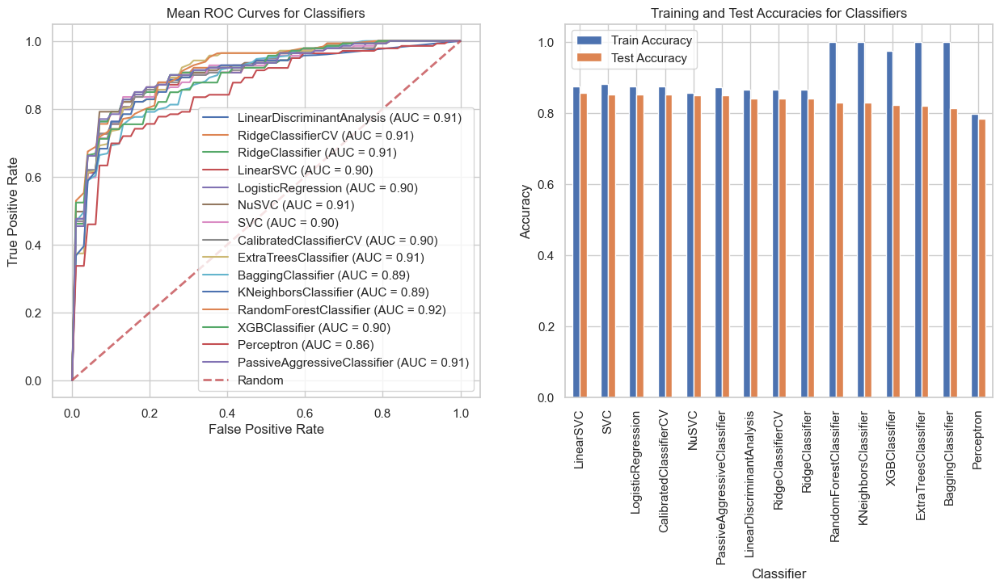

# Machine Learning for Heart Disease Classification

## 1. Background

This project was the final project for CS 508 Data Mining course that I took in Fall 2023. The aim of this project was to develop optimized machine learning models for classifying heart disease using the UCI Heart Disease dataset. The classification was treated as both a multiclass (5 levels) and binary problem based on disease severity.

## 2. Data

- UCI Heart Disease dataset 
- 920 instances, 14 attributes 
- Features: age, blood pressure, cholesterol etc.  
- Target: heart disease severity (0: no disease to 4)

## 3. Methods

### 3.1 Data Preprocessing

- Missing value imputation 
- Outlier detection/treatment
- Feature encoding/scaling (normalization)
- Class balancing using SMOTE 
- PCA dimensionality reduction

### 3.2 Model Development

**Binary Classification**

- Predicting heart disease presence (1) or absence (0)
- 15 classifiers tested e.g. Logistic Regression, SVM, RandomForest etc
- Grid search hyperparameter tuning
- Evaluation using Accuracy, AUC-ROC, F1, Recall, Precision etc.  

**Multiclass Classification** 

- 12 classifiers tested for predicting 5 levels of heart disease severity
- Random search for hyperparameter tuning
- Assessed using Accuracy, F1, Precision, Recall

### 3.3 Analysis

- Detailed EDA on data distribution
- Visual performance analysis 
  - Accuracy comparison plots 
  - ROC curves
- Identified best classifier for each case

## 4. Results

- Best Binary Classifier: **SVC** (86% accuracy)  **best accuracy in kaggle at that time to the best of knowlwdge**
- Published Jupyter notebooks detailing analysis 

**Multiclass Classification Results (Top 3 models)**

| Rank | Classifier           | Accuracy | Precision | Recall   | F1 Score | Best Hyperparameters                                                                                            |
| ---- | -------------------- | -------- | --------- | -------- | -------- | --------------------------------------------------------------------------------------------------------------- |
| 0    | RandomForest         | 0.608696 | 0.608324  | 0.608696 | 0.604288 | {'n_estimators': 400, 'min_samples_split': 2, 'min_samples_leaf': 1, 'max_features': 'log2', 'max_depth': None} |
| 1    | BaggingClassifier    | 0.597826 | 0.594148  | 0.597826 | 0.59097  | {'n_estimators': 50}                                                                                            |
| 2    | ExtraTreesClassifier | 0.586957 | 0.580685  | 0.586957 | 0.578814 | {'n_estimators': 200, 'max_depth': 20}                                                                          |

**Binary Classification Results (Top 3 models)** 

| Rank | Classifier             | Accuracy | Precision | Recall   | F1 Score | AUC    | Best Hyperparameters                           |
| ---- | ---------------------- | -------- | --------- | -------- | -------- | ------ | ---------------------------------------------- |
| 0    | SVC                    | 0.861039 | 0.853035  | 0.861039 | 0.857272 | 0.9015 | {'C': 10, 'kernel': 'rbf', 'gamma': 'scale'}   |
| 1    | NuSVC                  | 0.847457 | 0.835035  | 0.847457 | 0.840899 | 0.8878 | {'nu': 0.5, 'kernel': 'rbf', 'gamma': 'scale'} |
| 2    | RandomForestClassifier | 0.843913 | 0.845132  | 0.843913 | 0.844615 | 0.9249 | {'n_estimators': 300, 'max_depth': 10}         |

## 

  
   

**Figure 1:** ROC and Train/Test accuracy figures for the binary classifier

**Figure 2:** Comparison of test accuracies of various multiclass classifiers

## 5. Usage

The Jupyter notebooks provide full code to:

- Load and preprocess dataset
- Engineer features
- Train classification models
- Tune hyperparameters
- Evaluate and compare performance

## 6. Tools Used

- pandas, numpy - for data manipulation/analysis
- scikit-learn - for machine learning models
- matplotlib, seaborn - for data visualization
- imbalanced-learn - for handling class imbalance

## 7. Conclusion

Optimized machine learning pipelines developed for automated heart disease diagnosis. Models to predict both binary and multiclass outcomes compared and best classifiers identified based on empirical analysis.
